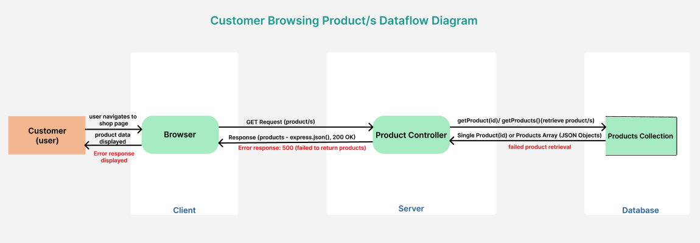
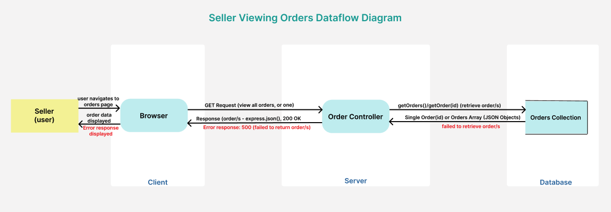
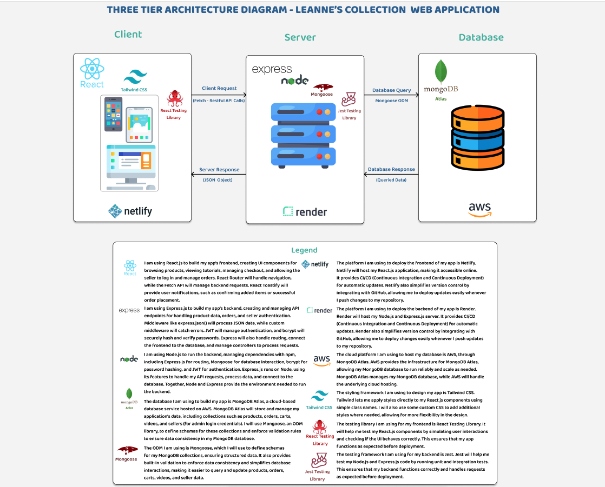
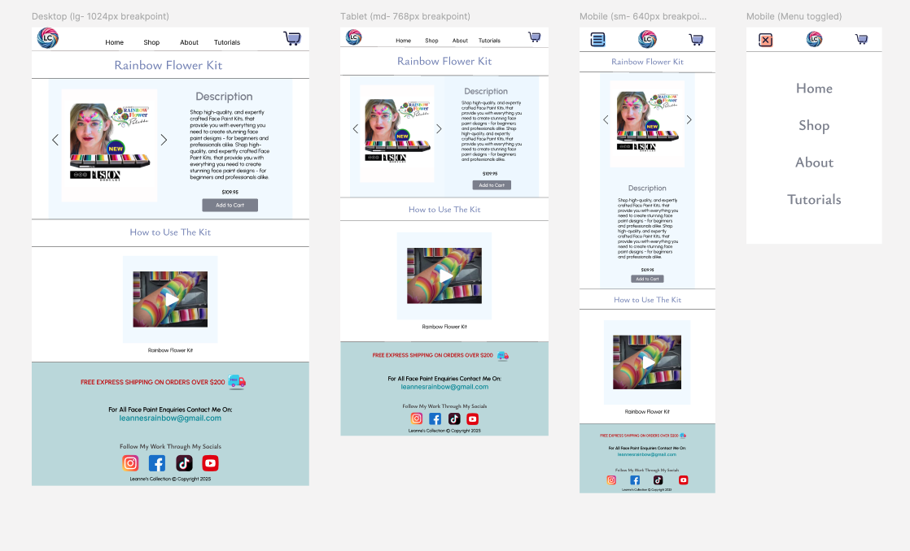

## R1. Description of your website, including:

- PURPOSE  
  The website is an eCommerce platform named 'Leanne's Collection' designed to offer customers a seamless shopping experience for Face and Body Paint Kits. Unlike other platforms, it focuses on providing complete kits that include everything a buyer needs. It caters to a diverse range of users, including professional face painters seeking high-quality FDA approved products, beginners exploring face painting as a potential career or hobby, parents looking for simple kits to create fun designs for their children's birthday parties, and schools or preschools needing easy-to-use kits for various events. 

  What sets this website apart is its ability to eliminate the guesswork often associated with purchasing face painting supplies. For those unfamiliar with the field, assembling the right products can feel both overwhelming and expensive. Questions such as “What paints should I buy: solid colours, one-strokes or split-cakes?”, “What type of brushes do I need: angle, flat, or filbert?”, “Do I need sponges: half-round or petal?”, and “What other products are essential?” can discourage potential customers. This platform addresses these concerns by helping buyers select the kit that best suits their needs, while providing clear and detailed information about what each kit includes, what designs can be created (Video Tutorials), and the occasions it is most appropriate for. By simplifying this process, the site ensures that even complete beginners can make confident, and importantly cost-efficient purchases.

  In addition to serving customers, the website also acts as a direct-to-consumer marketplace for the business owner. It provides a platform to showcase their expertise, and sell the face and body paint products that they themselves have designed. This includes promoting their unique product lines such as: paint palettes, one-strokes, brushes, and stencils, enhancing their brand presence in the face and body paint market/industry, and integrating their social media accounts to expand their reach.

  For this assignment, I will focus on building proxies for cart creation, checkout, and order creation, allowing customers to shop as guests. The business owner (admin) will be able to login to a dashboard where she can view all orders, access individual order details, and use a toggle button to update the order status between "Fulfilled" and "Unfulfilled." No additional inventory or product management features will be included at this stage.

  I think it is also important to mention that Leanne is a real person who is a well-known face and body paint artist with an already established online career and business, designing many products used by face painters around the world. She is also my big sister, my first client, and I am building this website for her.

  As I mentioned above, for this assignment, I will focus on creating proxies for cart creation, order checkout, and allowing the business owner to login, view orders, and update thier status. However, in the future, I plan to integrate Shopify APIs for managing orders, inventory, and payments. These features won't be included now due to time constraints and the sensitive information required for their integration.

  Since I am completing this project on my own, all products, videos, and other content will be pre-existing on the site, with no ability to edit, add, or remove them at this stage. However, I will certainly implement these features before the site goes live under the domain my sister has already secured.

- FUNCTIONALITY/FEATURES 
  1. Shop for Kits  
  The website provides a straightforward and user-friendly shopping experience, allowing customers to browse and purchase face and body paint kits with ease. Each product page provides a detailed breakdown of the kit's contents, including its purpose, the designs it can create, and suitable occasions. Comprehensive descriptions, pricing, and high-quality images/videos ensure that both beginners and professionals can easily find the right kit. Customers upon checkout can review, and update their shopping cart before proceeding to checkout.

  2. Quick Video Tutorials  
  Each kit's detailed page includes a short video designed to demonstrate its use or showcase the designs that can be created with it. These videos serve as quick and engaging tutorials, helping customers understand the product and how to use it effectively. This feature ensures that even beginners feel confident in their purchase.

  3. Customer Checkout Options  
  The website allows customers to complete their purchases as guests, eliminating the need for account creation. This streamlines the checkout process and enhances user convenience. A shopping cart icon is prominently displayed in the top right corner of almost every page, enabling customers to easily access their cart and proceed to checkout from anywhere on the site.

  4. Landing Page  
  The homepage or landing page will serve as the main entry point for the website, providing an engaging and visually appealing experience that introduces all key elements of the site. The hero section will immediately capture users' attention with vibrant face paint imagery and a clear call-to-action directing them to shop for face paint kits. As users scroll, they will find information about the available products (kits), a brief introduction to the seller, and a selection of embedded video tutorials showcasing these kits in action. Each section features clear call-to-action buttons, directing users to shop more kits (Shop Page), learn more about the seller (About Page), and explore additional tutorials (Tutorials Page). Additionally, the page will feature links to the seller’s social media pages, allowing users to explore more content and stay updated. The seller’s contact details will also be included in the footer, ensuring easy access across most pages in the app.

  5. Order Management  
  The business owner will have access to all customer orders, enabling them to track purchases and manage fulfillment. Through the admin dashboard, they can view order details and update the status of each order using a toggle feature to mark orders as fulfilled or unfulfilled. This functionality ensures the seller can efficiently monitor and manage the ordering process, keeping track of completed and pending orders with ease.

  6. Website Accessibility & Management    
  The platform will ensure that both customers and the business owner can navigate and manage the website with ease. The interface is designed for a seamless shopping experience, allowing users to browse and purchase kits, while the business owner has a dedicated portal to login, view, and manage orders. The website is fully optimised for all devices, using Tailwind CSS breakpoints to provide a smooth experience across smartphones (640px), tablets (768px), and desktops (1024px), ensuring accessibility and usability on any screen size.

- TARGET AUDIENCE  
  1. Professional Face Painters  
  The website targets experienced face and body paint artists who require high-quality products for their work. It offers complete kits with all the essential products needed to create a variety of professional designs for different events. These artists may also be interested in tutorial videos to learn new face paint designs and gather ideas for creating new unique looks, as well as staying up to date with new paint releases from Leanne's Collection.

  1. Beginners & Hobbyists   
  The website would also target individuals exploring face painting as a hobby or potential career move. Beginners would highly benefit from purchasing a complete kit, eliminating all the guesswork of selecting individual products while being a more cost-effective option. Additionally, the detailed product descriptions and video tutorials would help them understand the kit’s capabilities and the range of designs they can create, guiding them toward a more informed purchase decision.

  1. Parents & Guardians  
  The website would also target parents and caregivers looking for simple, safe, and easy-to-use kits to create fun face paint designs for their children at home, or for their kids birthday parties. They too would also greatly benefit from the detailed product descriptions, and engaging video tutorial videos.

  1. Schools & Childcare Centres
  The website would also target schools and childcare centres that require face painting kits for themed events, plays, school fairs, or simply fun activities to entertain children. These organisations would benefit from well-organised kits that include all necessary supplies, catering to different themes and occasions (eg; easter, christmas or halloween). Schools may also seek larger kits with increased quantities of paint and supplies, offering a wider variety of options to accommodate larger groups and events.

  1. Aspiring Entrepreneurs  
  The website would also target people looking to start their own face painting business. For example, many university students or stay-at-home parents may seek more flexible work opportunities that would fit around their children or school commitments. The website would help provide a great starting point for launching a face painting business by offering access to comprehensive kits with all the professional products needed. They could also benefit from the sellers expert guidance on product selection, tutorial videos, and links to the seller's social media, helping them learn more about face painting trends and industry practices.

  1. Social Media Influencers 
  The website would also target social media influencers who create content around face and body painting. The seller would largely benefit from influencers showcasing their exclusive line of paints and new releases, helping to increase brand awareness in the industry. By using and reviewing these high-quality products, influencers can generate excitement among their followers, driving interest and sales. Additionally, links to the seller's social media allow influencers to stay updated on new product launches and industry trends, further amplifying the brand's reach.

- TECH STACK  
  1. Frontend: React.js  
  The frontend will be built using React.js to provide a dynamic and responsive user interface. React Context API will manage global state, while Fetch API will handle API requests, with Axios as a potential alternative for improved request handling. React Toastify will be integrated to display notifications, while styling will be managed using Tailwind CSS, possibly Bootstrap, and CSS, to create a visually appealing and striking design.

  1. Backend: Node.js & Express.js  
  The backend will be developed using Node.js and Express.js, with Node providing the runtime environment for executing backend logic and managing dependencies using npm. The Express.js framework will handle HTTP requests, define API routes, manage middleware, and interact with the database.

  1.  Database: MongoDB & Mongoose    
  The database will use MongoDB, a NoSQL database, along with Mongoose to define schemas (ODM) for storing all necessary data related to products, orders, video tutorials and admin authentication. MongoDB Atlas will be used for cloud-based database hosting, with AWS as the chosen cloud provider, ensuring site security, scalability when needed, and easy accessibility.

  1. Development & Deployment  
  The development environment will be managed using VS Code as the text editor. Git & GitHub will be used for version control, allowing feature branching and efficient tracking of changes. For deployment, the frontend will be hosted on Netlify, while the backend will be deployed on Render, which provides the necessary server for running the backend (business logic).

  1. Security & Authentication  
  The backend will implement security measures using bcrypt, JWT, CORS, and admin authentication. Bcrypt will be used to securely hash and verify the admins (seller's) password before storing it in the database. JWT will handle authentication by generating tokens to verify the admin, manage their session, and restrict access to protected routes. Customers will not need authentication, as they will shop and checkout as guests without requiring an account. CORS will be set up to allow the frontend (on Netlify) to communicate securely with the backend (on Render). This prevents the browser from blocking requests and ensures only the approved website can access the API.

  1. Icons & UI/UX Design  
  The website's design will be planned using Figma, ensuring a well-structured UI before development begins. Icons, such as those for social media links, will be sourced from Font Awesome, Heroicons, and Google Material Icons, as they are free and do not require attribution. A favicon will be generated using Favicon.io to represent the site's brand logo, enhancing brand identity.

  1. E-Commerce & Payment Handling  
  For the assignment submission, proxies will be created to simulate cart creation, checkout, and payment functionality. Once the site goes live (after assignment submission/marking), the Shopify Admin API will be integrated to handle real eCommerce transactions, including cart creation, checkout, and payment processing.

## R2. Dataflow Diagram

### Customer Browsing Product/s Dataflow Diagram - Explained

- Customer Sends a GET Request  
The customer uses the web browser (client) to send a GET request to the server to retrieve product information. This request is sent via an API endpoint such as /api/products to fetch all available face paint kits or /api/products/:id to retrieve details about a specific product. The web client initiates this request whenever a customer visits the Shop Page to display all products or clicks on a specific item to view its details.

- Product Controller Receives the Request  
The server receives the GET request and processes it through the Product Controller. The controller determines whether the request is for all products or a specific product based on the API endpoint. It then calls the appropriate function (`getProducts()` or `getProduct(id)`) to retrieve the required data.  

- Product Controller Queries the Database  
The Product Controller queries the Products Collection in the database. If the request is for all products, it executes the `getProducts()` function to retrieve the full list of available kits. If the request is for a specific product, it calls the `getProduct(id)` function, using the provided product ID to fetch the corresponding product details. The query ensures that the appropriate data is retrieved based on the request type.  

- Database (Products Collection) Returns Data  
The database processes the query and returns the relevant data to the Product Controller. If the request was for all available products, it returns a JSON array containing all products. If the request included a specific product ID, it returns a JSON object with the details of that product. This ensures that the correct product information is retrieved and sent back to the controller for further processing.

- Product Controller Sends a Response to the Client
The Product Controller formats the retrieved data into a structured JSON response using express.json(), ensuring it is properly structured for the frontend. It then sends the response back to the client (browser). If the query was successful, the server returns a `200 OK` status code along with either an array of all products or a single product object, depending on the request. This allows the frontend to display the relevant product information accordingly.

- Error Handling in Product Retrieval  
If an issue occurs during the database query, such as an invalid product ID or a database connection error, the Product Controller catches the error. It then sends an appropriate error response to the client, typically returning a 500 Internal Server Error status along with a message indicating the failure to retrieve the product data. This ensures that the frontend is informed of the issue and can handle it accordingly.

  

### Seller Login Dataflow Diagram - Explained  

- Seller Sends a POST Request  
When the seller (admin) accesses their dedicated login portal page to manage the website, they enter their email and password into the login form there and submit it. This action triggers a POST request from the web browser (client) to the server, specifically targeting the API endpoint `/api/seller/login`. The request carries the seller's credentials in the request body and is routed to the Seller Controller, which processes the login request.

- Seller Controller Receives the Request  
The Seller Controller receives the POST request and processes the submitted login details (email & password). It extracts these credentials from the request body and calls the `verifySeller()` function, which is responsible for validating the provided details against the stored admin credentials stored in the database.

- Seller Controller Queries the Database  
The Seller Controller uses the `verifySeller()` function to query the database, specifically searching the Sellers Collection for a document that matches the provided email. If a matching seller account is found, the stored hashed password is retrieved and compared to the submitted password using bcrypt. If the credentials are valid, the seller is successfully logged in. If the email or password is incorrect, an error response is sent, and access is prevented.

- Database (Sellers Collection) Returns Data  
If the login details submitted are correct, the database confirms the seller’s identity and returns their details to the Seller Controller. This response includes the seller's ID and email, which are used to generate a JWT token for authenticating and authorising the seller when accessing protected endpoints on the platform.

- Seller Controller Generates a JWT
The Seller Controller generates a JWT (JSON Web Token) using the seller’s ID, email, and a timestamp. The token also has an expiration time to ensure security. This token allows the seller to stay logged in and access protected parts of the website, like viewing orders.

- Seller Controller Sends a Response to the Client 
If the login is successful, the Seller Controller sends back a JWT token with a `200 OK` status, allowing the seller to stay logged in and access protected routes of the site. If the login fails because the email or password was incorrect, the Seller Controller then returns a `401 Unauthorized` error, letting the seller know their login attempt failed.  

  

### Seller Viewing Orders Dataflow Diagram - Explained  

- Seller Sends a GET Request  
The seller uses the web browser (client) to send a GET request to the server to retrieve order information. This request is sent via an API endpoint such as `/api/orders` to fetch all customer orders or `/api/orders/:id` to retrieve details about a specific order. The web client initiates this request whenever the seller accesses the Orders Page in their dashboard to view all orders or clicks on a specific order number to see its full details.

-  Order Controller Receives the Request  
The Order Controller receives the GET request and processes it accordingly. If the request is for all orders, it calls the `getOrders()` function to retrieve all existing orders from the Orders Collection in the database. If the request is for a specific order, it calls the `getOrderById(id)` function to retrieve details for that particular order.

- Order Controller Queries the Database  
The Order Controller, through the `getOrders()` function, queries the Orders Collection in the database. The database processes this query and returns all stored order records, including order numbers, statuses, total prices, and customer names. If a specific order is requested, the controller calls `getOrderById(id)`, and the database responds with the corresponding order details, including the customer's shipping information and a breakdown of the ordered products, their quantities, and individual prices.

- Database (Orders Collection) Returns Data  
The database processes the query and responds to the Order Controller with the requested order data. For all orders, it returns a JSON array containing order records with just the essential details. For a specific order, it returns a JSON object with the complete order information, including the customer's shipping details and a detailed breakdown of their purchased items.

- Seller Controller Sends a Response to the Client 
If the request is successful, the Order Controller formats the retrieved data using express.json() and sends it back to the Seller (Client) with a `200 OK` status code. The response contains either a list of all customer orders or details of a specific order, depending on the request. If the query fails (eg; due to a database connection issue), the Order Controller returns a 500 Internal Server Error response, along with an error message indicating the failure.  

  

### Customer Browsing Video Tutorials Dataflow Diagram - Explained  

- Customer Sends a GET Request  
The customer uses the web browser (client) to send a GET request to retrieve all available face paint video tutorials from the website. This request is sent via the API endpoint `/api/tutorials`. The request is initiated when the customer navigates to the "Tutorials" page, prompting the server to fetch and return the list of video tutorials stored in the database.

-  Tutorials Controller Receives the Request  
The Tutorials Controller receives the GET request and processes it. It calls the `getTutorials()` function, which is responsible for retrieving the list of stored video tutorials from the database (Tutorials Collection).

- Tutorials Controller Queries the Database  
The Tutorials Controller uses the `getTutorials()` function to query the Tutorials Collection in the database. This query retrieves all video tutorial records (documents), which store the video information, including YouTube URLs, and video titles.

- Database (Tutorials Collection) Returns Data  
The database processes the query and sends the result back to the Tutorials Controller. The response is returned as a JSON array, containing all stored video tutorials with relevant details such as; the video title, and YouTube URL.

- Tutorials Controller Sends a Response to the Client 
If the request is successful, the Tutorials Controller formats the retrieved data using express.json() and sends it to the client with a `200 OK` status code. The frontend then embeds the videos using iframes, allowing customers to watch them directly on the website. If the query fails (eg; invalid database connection or query issue), the Tutorials Controller sends a 500 Internal Server Error response to the customer with an error message indicating the failure.   

  

### Customer Managing Cart (Add/Update/Delete) Dataflow Diagram - Explained  

- Customer Sends a GET/POST/PATCH/DELETE Request  
The customer interacts with the shopping cart through the web browser (client), sending different requests depending on their actions. When a customer visits the Shopping Cart Page, a GET request is sent to `/api/cart` to retrieve and display the current items in their cart. If they decide to add a product to their cart, they can do so either from the Shop Page or the Product Details Page, which triggers a POST request to `/api/cart` with that products details. If they wish to update the quantity of an item (eg; changing from 1 to 2), a PATCH request is sent to `/api/cart/:id` with the updated quantity. Similarly, if they decide to remove an item (eg; setting the quantity to 0), a DELETE request is sent to `/api/cart/:id`, ensuring the product is removed before proceeding to checkout.

-  Cart Controller Receives the Request  
The Cart Controller receives the request from the client and determines what operation is being performed based on the HTTP method (GET, POST, PATCH, or DELETE). If the request is a GET request, it calls the `getCart()` function to retrieve the customer's current cart. If the request is a POST request, it calls the `addToCart()` function to add a product to the cart. If the request is a PATCH request, it calls the `updateCart(id)` function to modify the quantity of a product in the cart. Lastly, if the request is a DELETE request, it calls the `deleteFromCart(id)` function to remove a product from the cart based on its ID.

- Cart Controller Queries the Database 
The Cart Controller then queries the database (Carts Collection) to carry out the requested operation. If the request is a GET request, the controller retrieves the customer's cart details from the database. If the request is a POST request, the controller inserts the new product into the customer's cart. If the request is a PATCH request, it modifies the quantity of a specific product in the cart. If the request is a DELETE request, the controller removes the specified product from the cart.

- Database (Carts Collection) Returns Data 
Once the query is processed, the database sends a response back to the Cart Controller. If the request was a GET, the database returns the cart details, including all products currently in the cart. If the request was a POST, the database confirms that the new product has been added. If the request was a PATCH, the database confirms that the quantity of the specified product has been updated. If the request was a DELETE, the database confirms that the product has been successfully removed from the cart. If an error occurs, such as an invalid product ID or a database connection failure, an error message is sent back to the Cart Controller.

- Cart Controller Sends a Response to the Client 
The Cart Controller processes the response received from the database and formats it using express.json(). If the operation was successful, the controller sends a `200 OK` status response back to the customer. For a GET request, the response contains the cart details. For a POST, PATCH, or DELETE request, the response contains a confirmation message such as "Product added to cart", "Cart updated successfully", or "Product removed from cart". If an error occurred, the Cart Controller sends an appropriate error response. A 400 Bad Request response is sent if the request contained invalid inputs, such as an incorrect product ID. A 500 Internal Server Error response is sent if a database issue prevented the operation from being completed successfully. 

  

### Customer Checking Out Order Dataflow Diagram - Explained  

- Customer Sends a POST Request  
When the customer proceeds to checkout, they are redirected to the checkout page, where they enter their name and shipping address into a form. Their cart items are displayed on this page. Once they complete the form and press the "Submit Payment" button, a POST request is sent to the server via the API endpoint `/api/orders`. This request includes the customer’s name, shipping address, and the cart details (an array containing product IDs, quantities, & prices). The request will only be processed if all required fields are filled out.

-  Order Controller Receives the Request  
The Order Controller receives the POST request and begins processing the order. Since the order needs to include the most up-to-date cart details, the controller sends a request to the Cart Controller to retrieve the customer’s cart data.

- Cart Controller Retrieves Cart Data  
The Cart Controller processes the request by querying the database (Carts Collection) to fetch the customer’s cart. The database returns the list of products in the cart along with their quantities. If the cart retrieval is unsuccessful due to an empty cart or a database error, an error response is sent back, preventing the order from being created.

- Order Controller Creates the Order  
If the cart retrieval is successful, the Order Controller processes the order by calling the `createOrder()` function. This function generates a new order record (document) in the database (Orders Collection), which includes the customer’s name, shipping details, the list of ordered products, their quantities, the total price of the order, and a unique order number.

- Database Returns Data to the Order Controller
The database (Orders Collection) processes the request and stores the new order. If the order creation is successful, the database sends back a confirmation message along with the newly created order number. If there is a database error, the system returns an error message instead.

- Order Controller Sends a Response to the Client 
If the order is successfully created, the Order Controller sends a response with a 201 Created status. The response includes a confirmation message informing the customer that their order was successful, along with the order number and shipping details. The checkout page updates to display this confirmation. If an error occurs at any stage, the Order Controller sends a 400 Bad Request response with an error message, and the checkout page informs the customer that the order could not be processed. 

## R3. Application Architecture Diagram
For my application, Leanne's Collection, I plan to follow a 3-tier monolithic architecture, represented in the diagram below by the three distinct layers: frontend (client tier), backend (server tier), and database (data tier). Since this application is built using the MERN stack, the following technologies will be used:

The frontend (client tier) will be built with React.js and deployed on Netlify, providing a responsive and intuitive interface for customers to browse face paint kits, watch tutorials, and complete purchases as guests. The seller (admin) will have access to a separate admin portal, where they can log in to view all customer orders.  

The backend (server tier) will be developed with Node.js and Express.js, hosted on Render. It will handle all API requests and business logic, which will be managed inside the application's controllers. These controllers will process incoming HTTP requests, validate data, interact with the database using Mongoose, enforce security using JWT authentication for the admin, and send structured JSON responses back to the frontend. This ensures the frontend can efficiently display product listings, order details, and video tutorials.

The database (data tier) will be powered by MongoDB Atlas (hosted on AWS), storing all product (kit) details, customer orders, and video information. Data will be structured and managed using Mongoose models, ensuring consistency, validation, and efficient querying.

While this monolithic setup is not as scalable as a microservices approach, it is the best choice for this project given the scope of this assignment and my current development skills.

**Side note**: In the future, when I launch Leanne's Collection as a fully functional eCommerce website, I plan to integrate Shopify APIs (such as the Admin API) to handle cart creation, checkout, and payments. For this assignment, I will build proxies to simulate this functionality. Offloading payments and order management to Shopify will improve scalability by reducing backend processing. Therefore, the diagram below reflects the current architecture for this assignment and not the future version that will incorporate third-party Shopify APIs.

 

## R4. User Stories

### **Initial User Stories**

USER STORIES FOR CUSTOMERS  
1. Shopping:  
  - As a customer, I want to look at the different kits, so I can decide what to buy.
  - As a customer, I want to add kits to my cart, so I can buy them later.
  - As a customer, I want to remove things from my cart, so I only purchase those things I want.
  - As a customer, I want to checkout without a guest, so I can make purchases quickly.

2. Viewing Pages:
  - As a customer, I want to read about the seller, so I know who I am buying from.
  - As a customer, I want to contact the seller, so I am able to ask any questions.
  - As a customer, I want to watch videos, so I can learn how to use the face painting products in kits.
  - As a customer, I want to read about the kits on offer, so I know which one I should buy.
  - As a customer, I want to find the seller’s social media, so I can follow them.

USER STORIES FOR BUSINESS OWNER 
1. Managing Orders:
  - As a business owner, I want to log in to my admin portal, so I can access customer orders.
  - As a business owner, I want to view all orders, so I can track purchases.
  - As a business owner, I want to view an individual order, so I can see order details.
  - As a business owner, I want to mark an order as fulfilled or unfulfilled, so I can track order completion.

2. Displaying Products for Customers:
  - I want my products to be displayed, so customers can browse and buy them.
  - As a business owner, I want product listings to show images, descriptions, and prices, so customers have all the necessary details.

3. Providing Video Tutorials for Customers:
  - As a business owner, I want video tutorials on my website, so customers can learn how to use the products.
  - As a business owner, I want videos to be embedded from YouTube, so customers can watch video's from my Youtube channel.

4. Seller Information & Socials for Customers:
  - As a business owner, I want an "About" page, so customers can learn who I am.
  - As a business owner, I want my social media links displayed, so customers can follow my content.
  - As a business owner, I want my contact details available, so customers can reach me for orders, bookings, and masterclasses.

### **Personas**
1. Professional Persona
  

2. Beginner & Hobbyist Persona
  

3. Parent/Guardian Persona
  

4. School Teacher Persona
 

5. Aspirational Entrepreneur Persona

6. Social Media Face Paint Influencer Persona

7. Business Owner Persona

### **Revised User Stories**

USER STORIES FOR CUSTOMERS  
1. Shopping:  
  - As a customer, I want to easily browse a selection of face paint kits, that include detailed descriptions and video's to help me best decide the one that suits my needs.
  - As a customer, I want to add kits to my shopping cart, so I can clearly review my selected items before making a purchase.
  - As a customer, I want to remove items from my shopping cart, so I can update my decision about what I would like to purchase.
  - As a customer, I want to checkout without registering an account, so I can quickly make purchases without entering my details until only the necessary ones are required at checkout for shipping my order.

2. Viewing Pages:
  - As a customer, I want to view an "About" page with photos, videos, and details about the business owner, so I can learn more about the person behind the brand, their new product lines, events, and touring information.
  - As a customer, I want to view a contact page with the business owner’s details, so I can reach out with questions regarding my orders, face painting tips and guidance, or face painting service booking requests and masterclasses.
  - As a customer, I want to view the tutorials page with a variety of videos, so I can learn how to use the kits on offer, pick up any face painting tips.
  - As a customer, I want to see detailed descriptions of what each face paint kit is used for, so I can make a more informed decision about choosing which kit is right for me.
  - As a customer, I want to easily access links to the business owner’s social media pages, such as YouTube, TikTok, Facebook, and Instagram, so I can see more seller content and tutorials about the paints on offer and how to use them.

USER STORIES FOR BUSINESS OWNER 
1. Seller Login & Order Management:
  - As a business owner, I want to log in securely using my email and password, so I can access my admin portal.
  - As a business owner, I want to be redirected to my dashboard after logging in, so I can immediately manage orders.
  - As a business owner, I want to view a list of all customer orders made, so I can track purchases made on my website.
  - As a business owner, I want each order in the list to display the order number, status (fulfilled/unfulfilled), order date, total price, and customer name, so I can quickly assess orders.
  -  As a business owner, I want to click on an order number, so I can view more details about that specific order.
  -  As a business owner, I want the order details page to show the customer's name, shipping address, and the products they ordered, including quantities and prices, so I can ensure correct fulfillment.
  -  As a business owner, I want to toggle the order status between fulfilled and unfulfilled, so I can keep track of which orders are completed.

2. Displaying Products for Customers:
  - As a business owner, I want my face paint kits to be displayed on the website, so customers can browse and purchase them.
  - As a business owner, I want each product listing to include an image, name, description, and price, so customers have the necessary details before making a purchase.
  - As a business owner, I want a dedicated "Shop" page where customers can browse all available kits in one place.
  - As a business owner, I want product to include an "Add to Cart" button, so customers can easily purchase items.

3. Providing Video Tutorials for Customers:
  - As a business owner, I want a dedicated "Video Tutorials" page, so customers can learn how to use my kits (products), and also pick up any handy face painting tips.
  - As a business owner, I want my tutorial videos to be embedded from my YouTube channel, so customers can watch them directly on my website.

4. Seller Information & Socials for Customers:
  - As a business owner, I want an "About" page that includes my bio and professional background, so customers can learn more about me.
  - As a business owner, I want my social media links: YouTube, Instagram, TikTok, Facebook to be displayed on my website, so customers can easily follow my content, and learn more about me.
  - As a business owner, I want my contact details like email, phone, and business enquiries available available from all pages, so customers can reach me about orders, face paint bookings, and masterclasses.
  - As a business owner, I want my social media links to also appear in the website footer, so customers can access them from any page.
  

## R5. Wireframes for multiple standard screen sizes, created using industry standard software

1. Home Page  

2. Shop Page  

3. Tutorials Page  

4. About Page  

5. Single Item Page  

6. Shopping Cart Page  

7. Checkout Page  

8. Order Success Page  

9. Seller Login Page  

10. Seller Orders Dashboard Page  

11.  Seller Single Order Page  

## R6. Screenshots of your Trello (or similar kanban system) board throughout the duration of the project

### Link to my Kanban style Trello board
[Trello Board]([./docs/owner-persona.png](https://trello.com/b/4fwy8Nat/leannes-collection-web-app))

### Screenshots of my Kanban style Trello board

  

  